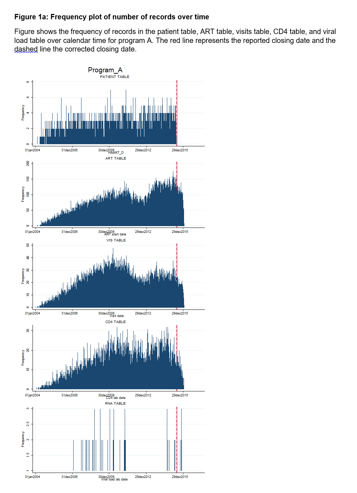
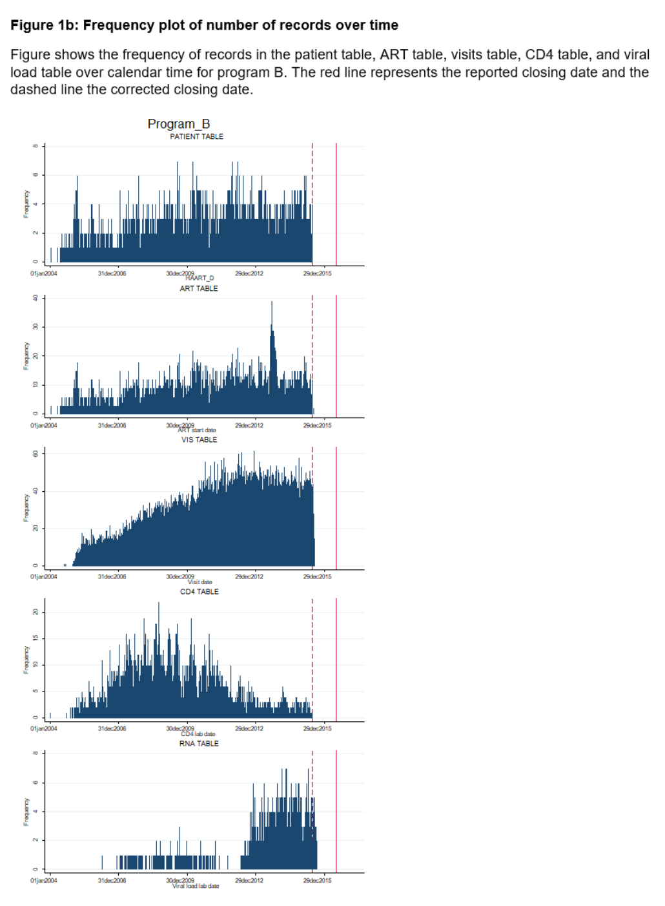

# 01_CLOSING_DATE

It is crucial for the valid analyses of retention in care that the closing date of the database is correct. Closing dates provided by ART programmes are often incorrect in IeDEA data. For example, an ART program may report a closing date of 31 Dec 2015 but pharmacy data (ART table) are only available until 30 Jun 2015. 

Do-file “01-CLOSING_DATE” checks the completeness of all tables from the beginning of the study (1 Jan 2004) to the closing date. If the closing date is incorrect (i.e. data in one or more tables are incomplete), an earlier closing date is selected. Never choose a closing date that is later than the closing date provided by the ART programme, even if all tables contain data after the provided closing date. 

This do-file creates frequency plots of the number of records in all five input tables over calendar time for each of the ART program. Plots are saves in the folder “…\RETENTION_TUTORIAL\FIGURES\ CLOSING_DATE”. 

Program A (Figure 1a) has complete data in all tables until the provided closing date, so we do not need to correct the closing date. Program B (Figure 1b), however, does not have complete data up until the provided closing date, so we need to choose an earlier closing date to ensure completeness of data from beginning of study until database closure (Figure 2).

The corrected closing date is saved in the variable my_close_d and will be used in all further analyses.

