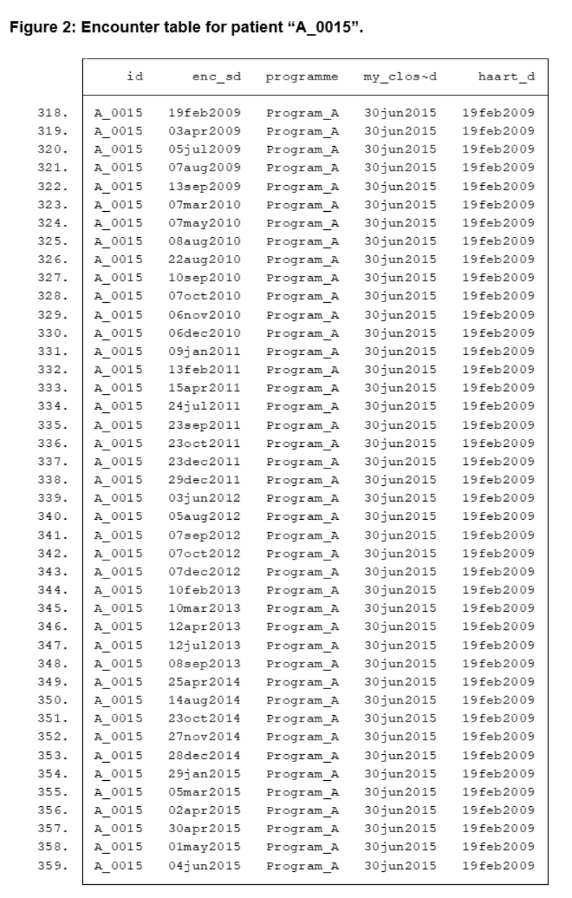
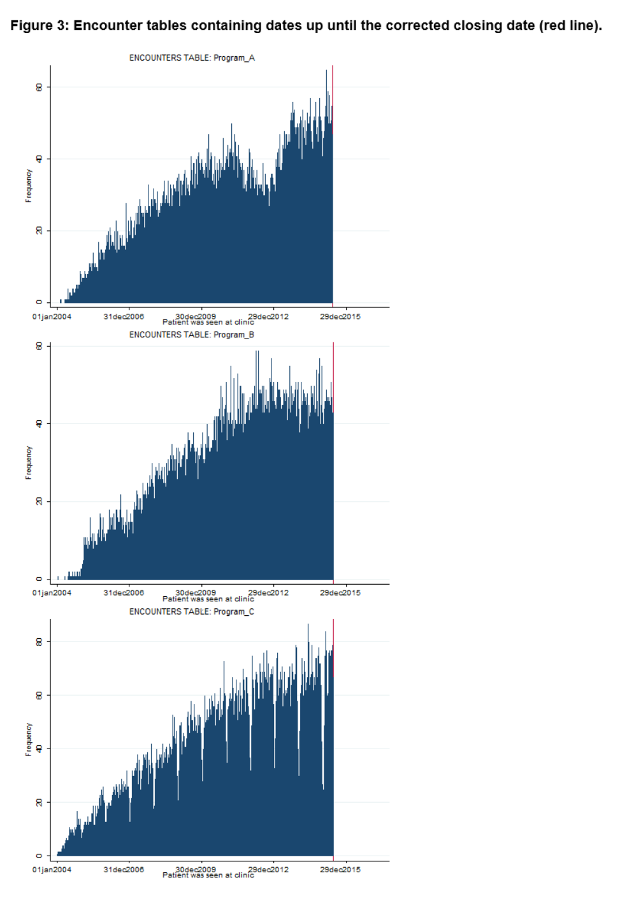

# 02_CLINIC_ENCOUNTERS
This do-file generates the clinic encounters table, which may contain multiple rows per patient. The clinic encounters table contains all dates (enc_sd) a patient was seen at the facility and is created by pooling all encounter dates contained in the five data tables (rna_dmy, cd4_dmy, art_sd, vis_dmy). The encounters table is unique for combinations of id and enc_sd. Figure 3 shows all the encounter dates pooled from the five data tables for patient A_0015. The encounter table only contains dates up until the corrected closing date.

