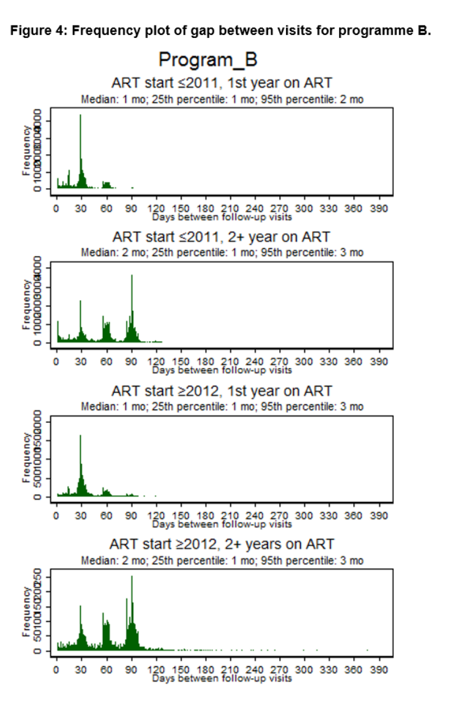

# 03_VISIT_FREQUENCY
In do-file “03_VISIT_FREQUENCY” we determine the typical appointment schedules of ART programs based on descriptive analyses of clinic encounter dates. We correct these estimates based on visual inspection of frequency plots and knowledge of treatment guidelines and local practices, if necessary. 
The do-file calculates the median, 25th and 95th percentile of the gaps between visits (in months) for each ART programme by number of years on ART (1 year, 2+ years) and year of ART start (≤2011, ≥2012). The do-file further generates frequency plots for the gap between visits (in days) for ART program by number of years on ART and year of ART start (Figure 4) and saves them in the folder “RETENTION_TUTORIAL\FIGURES\VISIT_FREQUENCY”. 
Based on visual inspection of the frequency plots and knowledge of treatment guidelines and local practices, gaps between visits that are <25th percentile or >the 95th percentile may be considered “unscheduled visits”. If the median, 25th or 95th percentile values are implausible, we can replace them with more plausible values. (Only plausible visit gaps are used to predict patients’ next appointment date in do-file 04_NEXT_APPOINTMENT_DATE). For instance, we could set the value saved in p95 for patients on ART for 2+ years in programme B to 4 months, as it seems that some patients were followed up every 4 months. When in doubt, select the larger gap to avoid misclassifying patients as LTF. 

