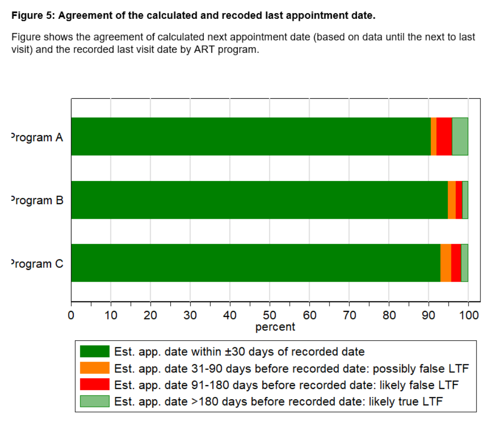

# 04_NEXT_APPOINTMENT_DATE
In do-file “04_NEXT_APPOINTMENT_DATE” we calculate patients’ next appointment date. The next appointment date is derived by adding the patient’s most recent and plausible gap between two consecutive visits (as determined in do-file 03_VISIT_FREQUENCY) to the last visit date. 
To validate the algorithm, we calculate the next appointment date based on data up to the next to last visit (i.e. recorded last visit date is excluded) and compare it with the recorded last visit date (Figure 5). For 93% of the patients, the next appointment date was correctly calculated (i.e. within ±30 days of the recorded last visit date). For 2.0% of the patients, the calculated next appointment date was 30 to 90 days before the recorded last visit date. Although it is possible that this error could lead to incorrect classification of patients (false LTF), the WHO definition has a 90 day window so patients visiting the clinic on time would not be misclassified. For 2.7% of patients the calculated next appointment date was 90 to 180 days before the recorded last visit date. These patients would be misclassified as LTF even if they visit the clinic on time, as this extends beyond the 90 day window. For 2.5% of patients the calculated next appointment date was more than 180 days before the recorded last visit date. These patients are likely correctly classified “true” LTF. 

