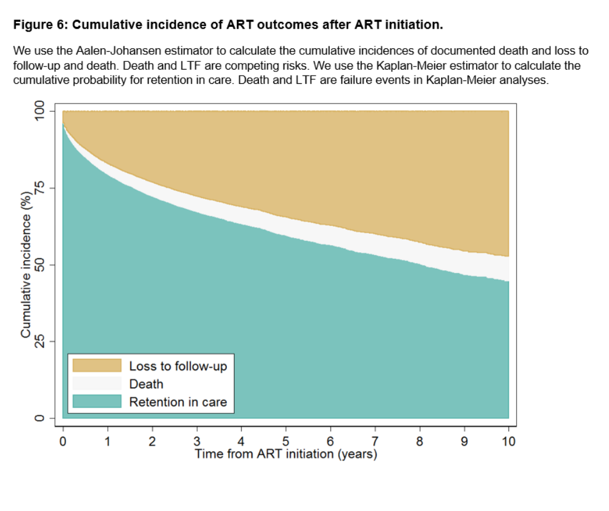
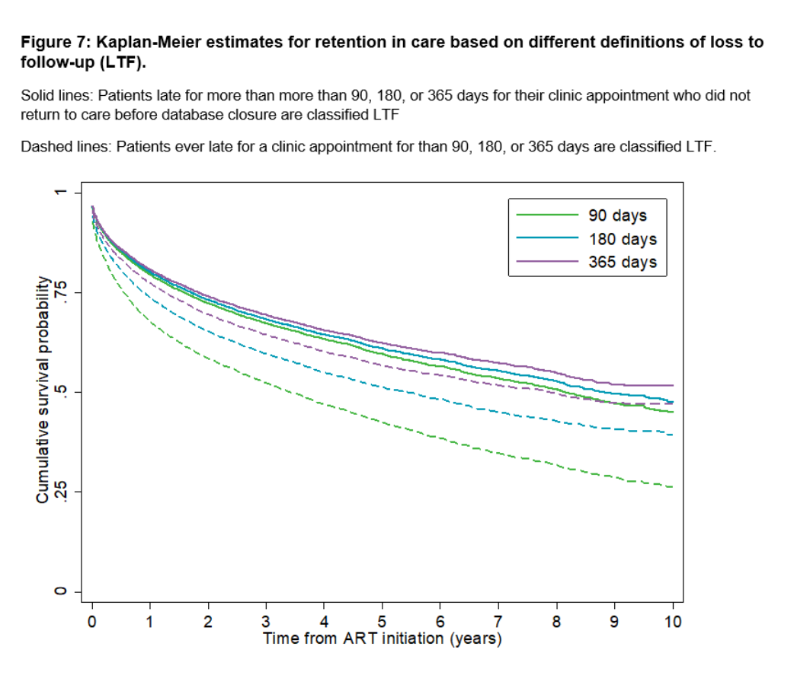

# 07_PLOT_OUTCOMES
Do-file “07_PLOT_OUTCOMES” generates a stacked area plot with cumulative incidence functions of ART outcomes for each of the six LTF scenarios (Figure 6). 
We follow patients from ART initiation for a maximum of 10 years. Individuals who transferred are censored on the date of transfer. Individuals retained on ART are censored 90 days before database closure, when they were no longer at risk of loss to follow-up. In sensitivity analyses, we compare Kaplan-Meier estimates for retention in care for all six scenarios of LTF (Figure 7).

