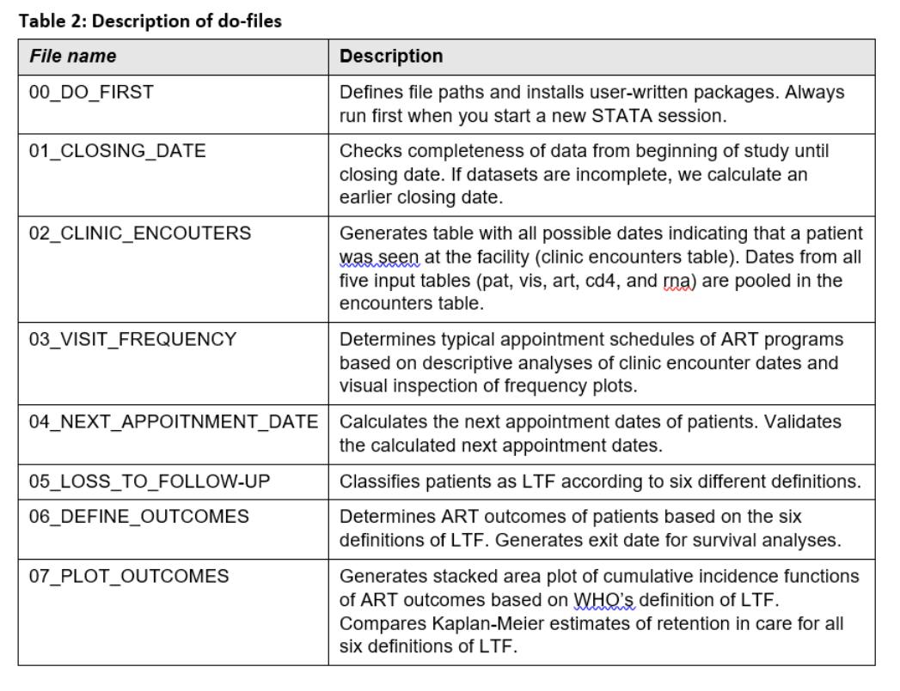
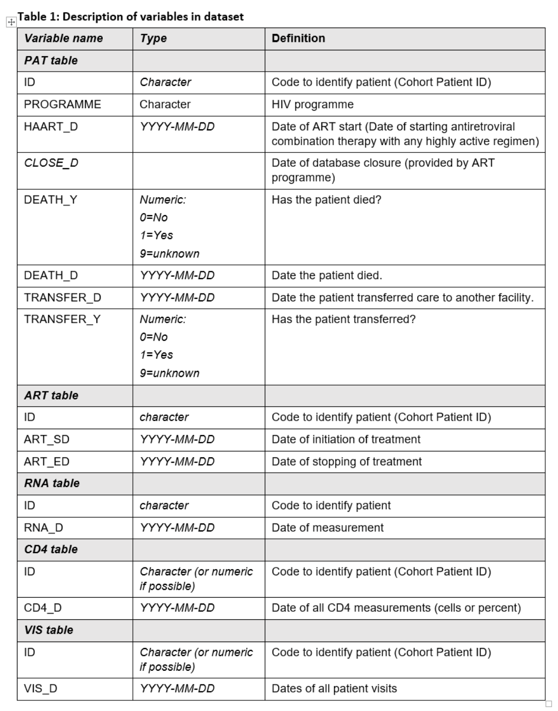

# Tutorial on how to implement the WHO definition for loss to follow-up

This repository shares and explains the [Tutorial pdf](DOCUMENT/ReadMe_v0.3.pdf) on how The International epidemiology Databases to Evaluate AIDS Southern Africa collaboration (IeDEA-SA) https://www.iedea-sa.org produced estimates for retention in care according to The World Health Organization's (WHO) https://www.who.int definition of lost to follow-up (LTF). 

These methods for implementing the WHO definition of LTFU were used in retention in care analyses produced by the IeDEA-WHO research-policy collaboration (2015-2017).

### *JVE* 2018 manuscript summarizing the IeDEA-WHO research-policy collaboration

> Zaniewski E, Tymejczyk O, Kariminia A, Desmonde S, Leroy V, Ford N, et al. IeDEA – WHO Research-Policy Collaboration: contributing real-world evidence to HIV progress reporting and guideline development. [J Virus Erad. 2018;4(Suppl 2):9–15.](https://pubmed.ncbi.nlm.nih.gov/30515309/)

### *JIAS* 2018 manuscript for retention in care in sub-Saharan Africa
> Haas AD, Zaniewski E, Anderegg N, Ford N, Fox MP, Vinikoor M, et al. Retention and mortality on antiretroviral therapy in sub-Saharan Africa: Collaborative analyses of HIV treatment programmes. [J Int AIDS Soc. 2018 Feb;21(2):e25084.](https://pubmed.ncbi.nlm.nih.gov/29479867/)

## Background

The WHO classifies patients >90 days late for their last scheduled appointment LTF. Scheduled appointment dates are often not recorded in HIV program data. In this tutorial, we illustrate how WHO’s definition of LTF can be implemented in HIV program data and describe statistical analyses of retention in care and other treatment outcomes including mortality, LTF and transfer between facilities. We provide a dataset with 15,000 simulated patients on antiretroviral therapy (ART) and Stata code to reproduce data management files and statistical analyses.

## Methods

This tutorial uses survival analysis methods to analyse time to loss to follow-up, stopping ART and death. Patients are followed from ART initiation for a maximum of 5 years, censoring follow-up time of patients who transferred to another clinic or programme that was not covered by IeDEA on the date of transfer. Individuals retained on ART are censored 90 days before database closure, when they cease to be at risk of loss to follow-up. The Kaplan–Meier estimator is used to calculate the cumulative probability of retention on ART and the Aalen-Johansen estimator is used to calculate the cumulative incidences of documented death or loss to follow-up and stopping ART. Death and loss to follow-up or stopping ART are competing risks.

All statistical analyses were performed using Stata version 14 (Stata Corp., College Station, TX, USA).

## Content  
This Tutorial is contained in the following four folders:  

* *DO*: Stata do-files to reproduce data management and statistical analyses files.  
* *DOCUMENT*: Tutorial document.  
* *FIGURES*: Analysis output figures.  
* *SIMULATED_DATA*: Simulated dataset that comprised of 15,000 simulated patients on ART.  

## *DO*  

A series of eight Stata "do-files" to reproduce the data management files and statistical analyses of this tutorial. These Stata do-files have the file format filename.do. If you use the do-files with your own HIV program data you need to run them in the correct order. If you use the simulated dataset, you can run any do-file after you have first run 00_DO_FIRST. 

   

***[00_DO_FIRST do file](DO/00_DO_FIRST_v1.do)***    
*[00_DO_FIRST ReadMe file](DO/00_DO_FIRST_v1.md)*   
Defines file paths and installs user-written packages. Always run first when you start a new Stata session.

***[01_CLOSING_DATE do file](DO/01_CLOSING_DATE_v2.do)***     
*[01_CLOSING_DATE ReadMe file](DO/01_CLOSING_DATE_v2.md)*  
It is crucial for the valid analyses of retention in care that the closing date of the database is correct. Closing dates provided by ART programmes are often incorrect in IeDEA data.
This do-file checks the completeness of all tables from the beginning of the study to the closing date. If the closing date is incorrect (i.e. data in one or more tables are incomplete), an earlier closing date is selected.

***[02_CLINIC_ENCOUNTERS_TABLE do file](DO/02_CLINIC_ENCOUNTERS_TABLE_v1.do)***     
*[02_CLINIC_ENCOUNTERS_TABLE ReadMe file](DO/02_CLINIC_ENCOUNTERS_TABLE_v1.md)*  
This do-file generates the clinic encounters table, which may contain multiple rows per patient. The clinic encounters table contains all dates (enc_sd) a patient was seen at the facility and is created by pooling all encounter dates contained in the five data tables (rna_dmy, cd4_dmy, art_sd, vis_dmy). The encounters table is unique for combinations of id and enc_sd. The encounter table only contains dates up until the corrected closing date.

***[03_VISIT_FREQUENCY do file](DO/03_VISIT_FREQUENCY_v1.do)***    
*[03_VISIT_FREQUENCY ReadMe file](DO/03_VISIT_FREQUENCY_v1.md)*  
We determine the typical appointment schedules of ART programs based on descriptive analyses of clinic encounter dates. We correct these estimates based on visual inspection of frequency plots and knowledge of treatment guidelines and local practices, if necessary.

***[04_NEXT_APPOINTMENT_DATE do file](DO/04_NEXT_APPOINTMENT_DATE_v1.do)***    
*[04_NEXT_APPOINTMENT_DATE ReadMe file](DO/04_NEXT_APPOINTMENT_DATE_v1.md)*  
We calculate patients’ next appointment date. The next appointment date is derived by adding the patient’s most recent and plausible gap between two consecutive visits (as determined in do-file 03_VISIT_FREQUENCY) to the last visit date. 

***[05_LOSS_TO_FOLLOW_UP do file](DO/05_LOSS_TO_FOLLOW_UP_v1.do)***    
*[05_LOSS_TO_FOLLOW_UP ReadMe file](DO/05_LOSS_TO_FOLLOW_UP_v1.md)*   
We classify patients LTF according to two different definitions across three time windows (90, 180, 365 days late) to create six possible scenarios.

***[06_DEFINE_OUTCOMES do file](DO/06_DEFINE_OUTCOMES_v1.do)***    
*[06_DEFINE_OUTCOMES ReadMe file](DO/06_DEFINE_OUTCOMES_v1.md)*  
We define ART outcomes for patients according to the six LTF scenarios defined in the previous do-file. ART outcomes are retained in care, transferred out, LTF, and dead. Outcomes are mutually exclusive. Dead and transfer out always supersede retention in care and LTF. Patients not LTF, transferred out, or dead are classified as retained in care.

***[07_PLOT_OUTCOMES do file](DO/07_PLOT_OUTCOMES_v2.do)***    
*[07_PLOT_OUTCOMES ReadMe file](DO/07_PLOT_OUTCOMES_v2.md)*  
This do-file generates a stacked area plot with cumulative incidence functions of ART outcomes for each of the six LTF scenarios. We use the Kaplan-Meier estimator to calculate the cumulative probability for retention in care. Death and LTF are failure events in Kaplan-Meier analyses. We use the Aalen-Johansen estimator to calculate the cumulative incidences of documented death and loss to follow-up and death. Death and LTF are competing risks.

## *DOCUMENT*  
The *[Tutorial pdf](DOCUMENT/ReadMe_v0.3.pdf)* describes each do file, the dataset tables and variables, and the output figures contained in this tutorial.

## *SIMULATED_DATA*  

This dataset contains simulated data from three HIV care programs each with 5,000 patients on ART. Patients initiated ART between 1 Jan 2004 and 21 Jun 2015. The dataset is comprised of five tables (PAT table, ART table, RNA table, CD4 table, VIS table) containing the key variables used in the IeDEA-WHO global analyses of retention in care.

  

The simulated data tables are in Stata Version 14 format and can be found in the following three subfolders:
* *CLEAN*  
* *INPUT_TABLES*  
* *TEMP*  

 

## Citation  

Tutorial for analyses of retention in care according to WHO’s definition of loss to follow-up by Andreas Haas, Elizabeth Zaniewski and Matthias Egger for IeDEA Southern Africa, 8 September 2017.  

## License   

This is an open access article under the [CC BY license.](LICENSE-CC-BY) https://creativecommons.org/licenses/by/4.0/  